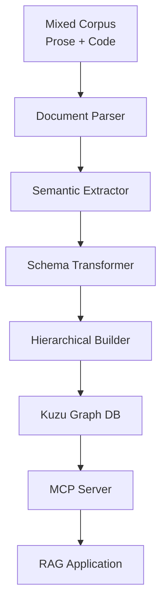

# Unified Document-to-Graph Pipeline: Prose & Code to MCP-Kuzu

## Pipeline Architecture Overview



## Stage 1: Document Parsing & Classification

```python
import ast
import spacy
from tree_sitter import Language, Parser
from typing import Dict, List, Union
from dataclasses import dataclass
from enum import Enum

class ContentType(Enum):
    PROSE = "prose"
    CODE = "code"
    MIXED = "mixed"

@dataclass
class DocumentChunk:
    id: str
    content: str
    type: ContentType
    metadata: Dict
    position: Dict  # {"start": 0, "end": 100, "parent": "doc_id"}

class UnifiedParser:
    def __init__(self):
        self.nlp = spacy.load("en_core_web_sm")
        self.code_parser = Parser()
        self.code_parser.set_language(Language('build/my-languages.so', 'python'))
    
    def parse_document(self, filepath: str) -> List[DocumentChunk]:
        """Parse mixed document into typed chunks"""
        chunks = []
        
        with open(filepath, 'r') as f:
            content = f.read()
        
        # Detect and split by content type
        segments = self._segment_content(content)
        
        for idx, segment in enumerate(segments):
            chunk_id = f"{filepath}#chunk_{idx}"
            
            if segment['type'] == ContentType.CODE:
                parsed = self._parse_code(segment['content'])
                chunk = DocumentChunk(
                    id=chunk_id,
                    content=segment['content'],
                    type=ContentType.CODE,
                    metadata={'ast': parsed, 'language': segment.get('language', 'python')},
                    position={'start': segment['start'], 'end': segment['end'], 
                             'parent': filepath}
                )
            else:
                parsed = self._parse_prose(segment['content'])
                chunk = DocumentChunk(
                    id=chunk_id,
                    content=segment['content'],
                    type=ContentType.PROSE,
                    metadata={'doc': parsed},
                    position={'start': segment['start'], 'end': segment['end'],
                             'parent': filepath}
                )
            
            chunks.append(chunk)
        
        return chunks
    
    def _parse_code(self, code: str) -> Dict:
        """Parse code into AST"""
        tree = self.code_parser.parse(bytes(code, "utf8"))
        return self._ast_to_dict(tree.root_node)
    
    def _parse_prose(self, text: str):
        """Parse prose with spaCy"""
        return self.nlp(text)
```

## Stage 2: Semantic Extraction

```python
from transformers import pipeline
import numpy as np

@dataclass
class SemanticTriple:
    subject: str
    predicate: str
    object: str
    confidence: float
    source_chunk: str
    context_type: ContentType

class SemanticExtractor:
    def __init__(self):
        self.srl_model = pipeline("text2text-generation", 
                                 model="Babelscape/rebel-large")
        self.embedder = pipeline("feature-extraction", 
                                 model="voyage-context-3")
    
    def extract_semantics(self, chunk: DocumentChunk) -> Dict:
        """Extract semantic triples and embeddings"""
        
        if chunk.type == ContentType.CODE:
            triples = self._extract_code_semantics(chunk)
        else:
            triples = self._extract_prose_semantics(chunk)
        
        # Generate hierarchical embeddings
        embeddings = self._generate_embeddings(chunk, triples)
        
        return {
            'triples': triples,
            'embeddings': embeddings,
            'chunk_id': chunk.id
        }
    
    def _extract_prose_semantics(self, chunk: DocumentChunk) -> List[SemanticTriple]:
        """Extract SVO triples from prose using SRL"""
        doc = chunk.metadata['doc']
        triples = []
        
        # Extract dependency-based triples
        for sent in doc.sents:
            for token in sent:
                if token.dep_ == "ROOT":
                    subject = self._find_subject(token)
                    objects = self._find_objects(token)
                    
                    for obj in objects:
                        triple = SemanticTriple(
                            subject=subject.text if subject else "",
                            predicate=token.lemma_,
                            object=obj.text,
                            confidence=0.95,
                            source_chunk=chunk.id,
                            context_type=ContentType.PROSE
                        )
                        triples.append(triple)
        
        # Extract named entity relations
        for ent in doc.ents:
            if ent.label_ in ["PERSON", "ORG", "GPE"]:
                context = self._get_entity_context(ent, doc)
                if context:
                    triples.append(context)
        
        return triples
    
    def _extract_code_semantics(self, chunk: DocumentChunk) -> List[SemanticTriple]:
        """Extract variable-operation-value triples from code"""
        ast_dict = chunk.metadata['ast']
        triples = []
        
        # Extract function definitions
        for node in self._find_nodes(ast_dict, 'function_definition'):
            triple = SemanticTriple(
                subject=node.get('name', 'function'),
                predicate='defines',
                object=self._get_function_signature(node),
                confidence=1.0,
                source_chunk=chunk.id,
                context_type=ContentType.CODE
            )
            triples.append(triple)
        
        # Extract assignments
        for node in self._find_nodes(ast_dict, 'assignment'):
            triple = SemanticTriple(
                subject=self._get_identifier(node['left']),
                predicate='assigned_value',
                object=self._get_value_repr(node['right']),
                confidence=1.0,
                source_chunk=chunk.id,
                context_type=ContentType.CODE
            )
            triples.append(triple)
        
        # Extract method calls
        for node in self._find_nodes(ast_dict, 'call'):
            triple = SemanticTriple(
                subject=self._get_caller(node),
                predicate='calls',
                object=self._get_function_name(node),
                confidence=1.0,
                source_chunk=chunk.id,
                context_type=ContentType.CODE
            )
            triples.append(triple)
        
        return triples
    
    def _generate_embeddings(self, chunk: DocumentChunk, 
                           triples: List[SemanticTriple]) -> Dict:
        """Generate multi-level embeddings"""
        
        # Chunk-level embedding with full context
        chunk_emb = self.embedder(chunk.content)[0]
        
        # Triple-level embeddings
        triple_embs = []
        for triple in triples:
            triple_text = f"{triple.subject} {triple.predicate} {triple.object}"
            triple_emb = self.embedder(triple_text)[0]
            triple_embs.append(triple_emb)
        
        # Statement-level embeddings (sentences/functions)
        if chunk.type == ContentType.PROSE:
            doc = chunk.metadata['doc']
            statement_embs = [self.embedder(sent.text)[0] for sent in doc.sents]
        else:
            # For code, embed function bodies
            functions = self._extract_functions(chunk.metadata['ast'])
            statement_embs = [self.embedder(func)[0] for func in functions]
        
        return {
            'chunk': np.array(chunk_emb).tolist(),
            'triples': [np.array(e).tolist() for e in triple_embs],
            'statements': [np.array(e).tolist() for e in statement_embs]
        }
```

## Stage 3: Unified Schema Transformation

```python
@dataclass
class UnifiedStatement:
    """Unified representation for both prose and code statements"""
    id: str
    content: str
    semantic_type: str  # "assertion", "definition", "relation", "operation"
    actors: List[str]   # subjects/variables
    actions: List[str]  # predicates/operations
    objects: List[str]  # objects/values
    modality: str       # "factual", "conditional", "hypothetical"
    confidence: float
    source_type: ContentType

class SchemaTransformer:
    """Transform to unified ontology following NIF + custom extensions"""
    
    def __init__(self):
        self.ontology = self._load_unified_ontology()
    
    def transform_to_unified(self, semantics: Dict) -> List[UnifiedStatement]:
        """Transform extracted semantics to unified schema"""
        unified_statements = []
        
        for triple in semantics['triples']:
            # Map to unified ontology
            semantic_type = self._classify_semantic_type(triple)
            
            # Normalize across domains
            actors = self._normalize_actors(triple.subject, triple.context_type)
            actions = self._normalize_actions(triple.predicate, triple.context_type)
            objects = self._normalize_objects(triple.object, triple.context_type)
            
            stmt = UnifiedStatement(
                id=f"{triple.source_chunk}#stmt_{len(unified_statements)}",
                content=f"{triple.subject} {triple.predicate} {triple.object}",
                semantic_type=semantic_type,
                actors=actors,
                actions=actions,
                objects=objects,
                modality=self._determine_modality(triple),
                confidence=triple.confidence,
                source_type=triple.context_type
            )
            unified_statements.append(stmt)
        
        return unified_statements
    
    def _classify_semantic_type(self, triple: SemanticTriple) -> str:
        """Classify statement type across domains"""
        if triple.context_type == ContentType.CODE:
            if triple.predicate in ['defines', 'declares']:
                return 'definition'
            elif triple.predicate in ['calls', 'invokes']:
                return 'operation'
            elif triple.predicate in ['assigned_value', 'returns']:
                return 'relation'
        else:
            if triple.predicate in ['is', 'are', 'was']:
                return 'assertion'
            elif any(modal in triple.predicate 
                    for modal in ['might', 'could', 'should']):
                return 'hypothetical'
            else:
                return 'relation'
        
        return 'relation'
    
    def _normalize_actors(self, subject: str, context: ContentType) -> List[str]:
        """Normalize subjects/variables to common representation"""
        if context == ContentType.CODE:
            # Extract variable name, class if method
            parts = subject.split('.')
            return parts
        else:
            # Extract entity and coreferences
            return [subject]
```

## Stage 4: Hierarchical Structure Building

```python
@dataclass
class HierarchicalNode:
    id: str
    level: str  # "document", "section", "paragraph", "statement", "token"
    content: str
    children: List['HierarchicalNode']
    parent_id: str
    metadata: Dict

class HierarchicalBuilder:
    """Build hierarchical document structure"""
    
    def build_hierarchy(self, chunks: List[DocumentChunk], 
                        statements: List[UnifiedStatement]) -> HierarchicalNode:
        """Create hierarchical document tree"""
        
        # Create document root
        doc_id = chunks[0].position['parent']
        root = HierarchicalNode(
            id=doc_id,
            level="document",
            content=doc_id,
            children=[],
            parent_id=None,
            metadata={'type': 'mixed', 'chunk_count': len(chunks)}
        )
        
        # Build chunk level
        for chunk in chunks:
            chunk_node = HierarchicalNode(
                id=chunk.id,
                level="section",
                content=chunk.content[:100] + "...",
                children=[],
                parent_id=doc_id,
                metadata={'type': chunk.type.value, 'position': chunk.position}
            )
            
            # Add statements as children
            chunk_statements = [s for s in statements 
                              if s.id.startswith(chunk.id)]
            
            for stmt in chunk_statements:
                stmt_node = HierarchicalNode(
                    id=stmt.id,
                    level="statement",
                    content=stmt.content,
                    children=[],
                    parent_id=chunk.id,
                    metadata={
                        'semantic_type': stmt.semantic_type,
                        'confidence': stmt.confidence
                    }
                )
                
                # Add token level for important entities
                for actor in stmt.actors:
                    token_node = HierarchicalNode(
                        id=f"{stmt.id}#actor_{actor}",
                        level="token",
                        content=actor,
                        children=[],
                        parent_id=stmt.id,
                        metadata={'role': 'actor', 'value': actor}
                    )
                    stmt_node.children.append(token_node)
                
                chunk_node.children.append(stmt_node)
            
            root.children.append(chunk_node)
        
        return root
```

## Stage 5: Kuzu Database Storage

```python
import kuzu

class KuzuGraphBuilder:
    """Store unified hierarchy in Kuzu with vector support"""
    
    def __init__(self, db_path: str):
        self.db = kuzu.Database(db_path)
        self.conn = kuzu.Connection(self.db)
        self._create_schema()
    
    def _create_schema(self):
        """Create unified schema in Kuzu"""
        
        # Node tables for hierarchy
        self.conn.execute("""
            CREATE NODE TABLE IF NOT EXISTS Document(
                id STRING PRIMARY KEY,
                title STRING,
                type STRING,
                created_at TIMESTAMP,
                document_embedding FLOAT[768]
            )
        """)
        
        self.conn.execute("""
            CREATE NODE TABLE IF NOT EXISTS Section(
                id STRING PRIMARY KEY,
                content TEXT,
                type STRING,
                position_start INT64,
                position_end INT64,
                section_embedding FLOAT[768]
            )
        """)
        
        self.conn.execute("""
            CREATE NODE TABLE IF NOT EXISTS Statement(
                id STRING PRIMARY KEY,
                content TEXT,
                semantic_type STRING,
                modality STRING,
                confidence FLOAT,
                statement_embedding FLOAT[384]
            )
        """)
        
        # Unified semantic triple storage
        self.conn.execute("""
            CREATE NODE TABLE IF NOT EXISTS Entity(
                id STRING PRIMARY KEY,
                text STRING,
                type STRING,
                normalized_form STRING
            )
        """)
        
        self.conn.execute("""
            CREATE REL TABLE IF NOT EXISTS SEMANTIC_TRIPLE(
                FROM Entity TO Entity,
                predicate STRING,
                confidence FLOAT,
                source_statement STRING,
                context_type STRING
            )
        """)
        
        # Hierarchical relationships
        self.conn.execute("""
            CREATE REL TABLE IF NOT EXISTS CONTAINS(
                FROM Document TO Section
            )
        """)
        
        self.conn.execute("""
            CREATE REL TABLE IF NOT EXISTS HAS_STATEMENT(
                FROM Section TO Statement,
                sequence INT64
            )
        """)
        
        # Cross-references for mixed documents
        self.conn.execute("""
            CREATE REL TABLE IF NOT EXISTS REFERENCES(
                FROM Statement TO Statement,
                reference_type STRING
            )
        """)
        
        # Create vector indices
        self.conn.execute("""
            CALL CREATE_VECTOR_INDEX('Document', 'doc_embedding_idx', 
                                    'document_embedding', 768, 'cosine')
        """)
        
        self.conn.execute("""
            CALL CREATE_VECTOR_INDEX('Statement', 'stmt_embedding_idx',
                                    'statement_embedding', 384, 'cosine')
        """)
    
    def store_hierarchy(self, root: HierarchicalNode, embeddings: Dict):
        """Store hierarchical structure with embeddings"""
        
        # Store document node
        self.conn.execute("""
            CREATE (:Document {
                id: $id, 
                title: $title, 
                type: $type,
                created_at: now(),
                document_embedding: $embedding
            })
        """, {
            'id': root.id,
            'title': root.content,
            'type': root.metadata['type'],
            'embedding': embeddings.get('document', [0.0] * 768)
        })
        
        # Store sections and statements
        for section in root.children:
            self._store_section(section, root.id, embeddings)
    
    def _store_section(self, section: HierarchicalNode, 
                      doc_id: str, embeddings: Dict):
        """Store section with its statements"""
        
        # Create section node
        self.conn.execute("""
            CREATE (:Section {
                id: $id,
                content: $content,
                type: $type,
                position_start: $start,
                position_end: $end,
                section_embedding: $embedding
            })
        """, {
            'id': section.id,
            'content': section.content,
            'type': section.metadata['type'],
            'start': section.metadata['position']['start'],
            'end': section.metadata['position']['end'],
            'embedding': embeddings.get(section.id, [0.0] * 768)
        })
        
        # Create relationship to document
        self.conn.execute("""
            MATCH (d:Document {id: $doc_id}), (s:Section {id: $section_id})
            CREATE (d)-[:CONTAINS]->(s)
        """, {'doc_id': doc_id, 'section_id': section.id})
        
        # Store statements
        for idx, stmt in enumerate(section.children):
            self._store_statement(stmt, section.id, idx, embeddings)
    
    def _store_statement(self, stmt: HierarchicalNode, 
                        section_id: str, sequence: int, embeddings: Dict):
        """Store individual statements with semantic information"""
        
        # Create statement node
        self.conn.execute("""
            CREATE (:Statement {
                id: $id,
                content: $content,
                semantic_type: $semantic_type,
                modality: $modality,
                confidence: $confidence,
                statement_embedding: $embedding
            })
        """, {
            'id': stmt.id,
            'content': stmt.content,
            'semantic_type': stmt.metadata.get('semantic_type', 'unknown'),
            'modality': stmt.metadata.get('modality', 'factual'),
            'confidence': stmt.metadata.get('confidence', 1.0),
            'embedding': embeddings.get(stmt.id, [0.0] * 384)
        })
        
        # Link to section
        self.conn.execute("""
            MATCH (sec:Section {id: $section_id}), 
                  (stmt:Statement {id: $stmt_id})
            CREATE (sec)-[:HAS_STATEMENT {sequence: $seq}]->(stmt)
        """, {
            'section_id': section_id, 
            'stmt_id': stmt.id,
            'seq': sequence
        })
```

## Stage 6: MCP Server Implementation

```python
# mcp_kuzu_server.py
from mcp import Server, Tool, Resource
import json
from typing import List, Dict, Any

class KuzuMCPServer:
    """MCP server for unified Kuzu graph database"""
    
    def __init__(self, db_path: str):
        self.server = Server("kuzu-unified-ontology")
        self.db = kuzu.Database(db_path)
        self.conn = kuzu.Connection(self.db)
        self._register_tools()
    
    def _register_tools(self):
        """Register MCP tools for semantic search"""
        
        @self.server.tool()
        async def semantic_search(
            query: str, 
            search_type: str = "hybrid",
            limit: int = 10
        ) -> List[Dict]:
            """
            Search unified knowledge graph
            
            Args:
                query: Natural language query
                search_type: "vector", "graph", or "hybrid"
                limit: Number of results
            
            Returns:
                List of relevant statements with context
            """
            
            # Generate query embedding
            query_embedding = self._embed_query(query)
            
            if search_type in ["vector", "hybrid"]:
                # Vector similarity search
                vector_results = self.conn.execute("""
                    CALL QUERY_VECTOR_INDEX('Statement', 'stmt_embedding_idx',
                                          $embedding, $limit)
                    WITH node AS stmt, distance
                    MATCH (sec:Section)-[:HAS_STATEMENT]->(stmt)
                    MATCH (doc:Document)-[:CONTAINS]->(sec)
                    RETURN stmt.content AS statement,
                           stmt.semantic_type AS type,
                           sec.type AS section_type,
                           doc.title AS document,
                           distance
                    ORDER BY distance
                """, {
                    'embedding': query_embedding,
                    'limit': limit
                }).fetchall()
            
            if search_type in ["graph", "hybrid"]:
                # Extract entities from query
                entities = self._extract_entities(query)
                
                # Graph traversal search
                graph_results = self.conn.execute("""
                    MATCH (e:Entity)
                    WHERE e.text IN $entities OR e.normalized_form IN $entities
                    MATCH (e)-[r:SEMANTIC_TRIPLE]-(related:Entity)
                    MATCH (stmt:Statement {id: r.source_statement})
                    MATCH (sec:Section)-[:HAS_STATEMENT]->(stmt)
                    MATCH (doc:Document)-[:CONTAINS]->(sec)
                    RETURN DISTINCT stmt.content AS statement,
                           r.predicate AS relation,
                           stmt.semantic_type AS type,
                           sec.type AS section_type,
                           doc.title AS document,
                           r.confidence AS confidence
                    ORDER BY confidence DESC
                    LIMIT $limit
                """, {
                    'entities': entities,
                    'limit': limit
                }).fetchall()
            
            # Combine and rank results
            return self._merge_results(vector_results, graph_results)
        
        @self.server.tool()
        async def get_context_hierarchy(
            statement_id: str,
            levels_up: int = 2,
            levels_down: int = 1
        ) -> Dict:
            """
            Get hierarchical context for a statement
            
            Args:
                statement_id: ID of the statement
                levels_up: Number of parent levels to retrieve
                levels_down: Number of child levels to retrieve
            
            Returns:
                Hierarchical context tree
            """
            
            result = self.conn.execute("""
                MATCH (stmt:Statement {id: $stmt_id})
                OPTIONAL MATCH (sec:Section)-[:HAS_STATEMENT]->(stmt)
                OPTIONAL MATCH (doc:Document)-[:CONTAINS]->(sec)
                OPTIONAL MATCH (stmt)-[:REFERENCES]-(related:Statement)
                RETURN stmt, sec, doc, collect(related) as related_statements
            """, {'stmt_id': statement_id}).fetchone()
            
            return self._build_context_tree(result)
        
        @self.server.tool()
        async def trace_cross_references(
            entity: str,
            max_hops: int = 3
        ) -> List[Dict]:
            """
            Trace entity references across prose and code
            
            Args:
                entity: Entity to trace
                max_hops: Maximum graph traversal depth
            
            Returns:
                Cross-references between prose documentation and code
            """
            
            results = self.conn.execute("""
                MATCH (e:Entity {normalized_form: $entity})
                MATCH path = (e)-[:SEMANTIC_TRIPLE*1..$max_hops]-(connected:Entity)
                WITH path, connected
                MATCH (connected)-[r:SEMANTIC_TRIPLE]-(target:Entity)
                WHERE r.context_type IN ['prose', 'code']
                RETURN DISTINCT
                    connected.text AS entity,
                    r.predicate AS relation,
                    target.text AS target,
                    r.context_type AS domain,
                    r.source_statement AS source
                ORDER BY length(path)
            """, {
                'entity': entity,
                'max_hops': max_hops
            }).fetchall()
            
            return self._format_cross_references(results)
```

## Stage 7: Configuration & Deployment

```yaml
# config.yaml
pipeline:
  input:
    paths:
      - "./corpus/documentation/*.md"
      - "./corpus/source_code/**/*.py"
      - "./corpus/notebooks/*.ipynb"
    
  processing:
    batch_size: 100
    parallel_workers: 4
    
  semantic_extraction:
    srl_model: "Babelscape/rebel-large"
    embedding_model: "voyage-context-3"
    embedding_dimensions:
      document: 768
      statement: 384
      token: 256
    
  kuzu:
    database_path: "./data/unified_kg.db"
    cache_embeddings: true
    vector_index_params:
      m: 16
      ef_construction: 200
      ef_search: 100
    
  mcp_server:
    host: "localhost"
    port: 8765
    auth_token: "${MCP_AUTH_TOKEN}"
```

```python
# main.py - Pipeline Orchestrator
class UnifiedPipeline:
    def __init__(self, config_path: str):
        self.config = self._load_config(config_path)
        self.parser = UnifiedParser()
        self.extractor = SemanticExtractor()
        self.transformer = SchemaTransformer()
        self.builder = HierarchicalBuilder()
        self.kuzu = KuzuGraphBuilder(self.config['kuzu']['database_path'])
        self.mcp = KuzuMCPServer(self.config['kuzu']['database_path'])
    
    def process_corpus(self):
        """Execute full pipeline"""
        
        for doc_path in self.config['pipeline']['input']['paths']:
            print(f"Processing: {doc_path}")
            
            # Stage 1: Parse
            chunks = self.parser.parse_document(doc_path)
            
            # Stage 2: Extract semantics
            all_semantics = []
            for chunk in chunks:
                semantics = self.extractor.extract_semantics(chunk)
                all_semantics.append(semantics)
            
            # Stage 3: Transform to unified schema
            unified_statements = []
            for semantics in all_semantics:
                statements = self.transformer.transform_to_unified(semantics)
                unified_statements.extend(statements)
            
            # Stage 4: Build hierarchy
            hierarchy = self.builder.build_hierarchy(chunks, unified_statements)
            
            # Stage 5: Store in Kuzu
            embeddings = self._collect_embeddings(all_semantics)
            self.kuzu.store_hierarchy(hierarchy, embeddings)
            
            print(f"Stored {len(unified_statements)} statements")
        
        # Stage 6: Start MCP server
        print("Starting MCP server...")
        self.mcp.start()

if __name__ == "__main__":
    pipeline = UnifiedPipeline("config.yaml")
    pipeline.process_corpus()
```

## Claude Desktop Integration

```json
{
  "mcpServers": {
    "kuzu-unified": {
      "command": "python",
      "args": ["mcp_kuzu_server.py"],
      "env": {
        "KUZU_DB_PATH": "./data/unified_kg.db",
        "MCP_AUTH_TOKEN": "your-token-here"
      }
    }
  }
}
```

## Query Examples

```python
# Hybrid search combining vector similarity and graph traversal
result = await mcp.semantic_search(
    query="How does the authentication system validate user tokens?",
    search_type="hybrid",
    limit=5
)

# Trace how a concept is implemented across documentation and code
references = await mcp.trace_cross_references(
    entity="TokenValidator",
    max_hops=3
)

# Get full hierarchical context for understanding
context = await mcp.get_context_hierarchy(
    statement_id="doc_auth.py#chunk_5#stmt_12",
    levels_up=2,
    levels_down=1
)
```

This pipeline provides:
- **Unified parsing** of mixed prose/code documents
- **Semantic extraction** preserving domain-specific semantics
- **Schema transformation** to unified ontology
- **Hierarchical storage** in Kuzu with vector support
- **MCP server** for seamless RAG integration
- **Cross-domain tracing** connecting documentation to implementation

The system maintains semantic coherence across domains while leveraging Kuzu's performance optimizations and MCP's standardized interface.
