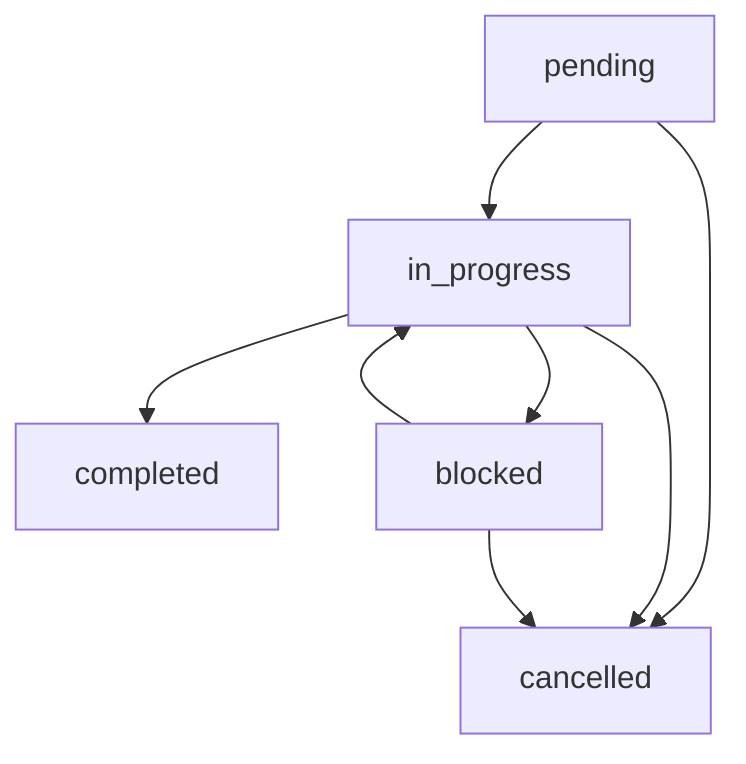

# AI Task Management & Session Workflow

Comprehensive task management system optimized for AI agents, including priority frameworks, session workflow patterns, and integration with MCP servers for enhanced development productivity.

## Task Management Philosophy

### AI-Optimized Task Tracking

**Strategic Approach to AI Task Management:**
Traditional task management tools are designed for human workflows. AI agents require structured, machine-readable task definitions with clear acceptance criteria, priority frameworks, and session continuity patterns.

**Benefits of AI-Specific Task Management:**
- **Context Continuity**: Tasks maintain context across AI sessions
- **Priority Optimization**: AI can automatically prioritize based on technical and business factors
- **Token Efficiency**: Structured task definitions reduce context overhead
- **Quality Assurance**: Built-in validation and testing requirements
- **Integration Ready**: Native connection to MCP servers and development tools

## Task Priority Framework

### 🔴 Critical Priority
**Timeline**: Fix within 24 hours
**Scope**: Security issues, production bugs, data loss risks

**Task Template:**
```markdown
### TASK-001: [Critical task title]
- **Status**: pending
- **Created**: 2025-01-27
- **Context**: [Describe the problem and why it's critical]
- **Files**: `path/to/relevant/files`
- **Security Impact**: [If applicable]
- **Acceptance Criteria**:
  - [ ] Issue resolved and verified
  - [ ] Security audit passed (if applicable)
  - [ ] Tests pass
  - [ ] Production deployment successful
- **Rollback Plan**: [Procedure if deployment fails]
- **Notes**: [Any additional context or constraints]
```

### 🟡 High Priority
**Timeline**: Fix within 3 days
**Scope**: Feature blocking, performance issues, user-facing bugs

**Task Template:**
```markdown
### TASK-002: [High priority task]
- **Status**: pending
- **Created**: 2025-01-27
- **Dependencies**: [List any blocking tasks]
- **Context**: [Why this needs attention soon]
- **Files**: `src/`, `tests/`
- **Performance Impact**: [If applicable]
- **Acceptance Criteria**:
  - [ ] Implementation complete
  - [ ] Tests written and passing
  - [ ] Documentation updated
  - [ ] Code reviewed
- **Estimated Tokens**: 5000-20000
```

### 🟢 Normal Priority
**Timeline**: Fix within sprint cycle
**Scope**: Regular development tasks, refactoring, improvements

**Task Template:**
```markdown
### TASK-003: [Standard development task]
- **Status**: pending
- **Created**: 2025-01-27
- **Context**: [Standard development work description]
- **Integration Points**: [Related systems or components]
- **Acceptance Criteria**:
  - [ ] Feature implemented per specifications
  - [ ] Code reviewed and approved
  - [ ] Tests added with 80%+ coverage
  - [ ] Deployed to staging environment
- **Estimated Tokens**: 2000-5000
```

### 🔵 Low Priority / Backlog
**Timeline**: Fix when convenient
**Scope**: Nice-to-have features, minor improvements, technical debt

**Task Template:**
```markdown
### TASK-004: [Enhancement or technical debt]
- **Status**: pending
- **Created**: 2025-01-27
- **Type**: enhancement|refactor|technical_debt
- **Context**: [Why this would be beneficial]
- **Business Value**: [Expected impact]
- **Technical Value**: [Code quality improvement]
- **Estimated Tokens**: 1000-3000
```

## Task Status Workflow

### Status Definitions

- **pending**: Not started, available for work
- **in_progress**: Currently being worked on by an AI agent
- **blocked**: Cannot proceed due to external dependencies
- **completed**: All acceptance criteria met and validated
- **cancelled**: No longer needed (archive with reason)

### Status Transition Workflow



### Session Management Integration

**When Starting AI Session:**
1. Review all sections in priority order
2. Check for blocked tasks that may be unblocked
3. Move abandoned "In Progress" tasks back to appropriate priority
4. Select highest priority available task

**When Starting a Task:**
1. Move task to "🚧 In Progress" section
2. Add started timestamp and session ID
3. Update status to `in_progress`
4. Load relevant context from [32_workflow-patterns.md](./32_workflow-patterns.md)

**During Task Execution:**
1. Check off completed acceptance criteria
2. Update notes with discoveries or blockers
3. Reference task ID in commit messages
4. Monitor token usage against estimates

**When Completing a Task:**
1. Verify all acceptance criteria met
2. Move to "Completed Tasks Archive"
3. Record time taken and token usage
4. Add brief result summary and lessons learned
5. Update any dependent tasks

**When Blocked:**
1. Move task to "⏸️ Blocked" section
2. Clearly document the blocker
3. Create new task for blocker resolution if needed
4. Notify team members if human intervention required

## AI Agent Instructions

### Session Workflow Patterns

**At Session Start:**
```markdown
1. **Context Loading**:
   - Review project context from GEMINI.md
   - Check current TODO status
   - Load relevant MCP server configurations

2. **Priority Assessment**:
   - Scan for Critical (🔴) items requiring immediate attention
   - Review High (🟡) priority tasks blocking other work
   - Select optimal task based on context and capabilities

3. **Preparation**:
   - Load relevant files and dependencies
   - Verify test environment status
   - Check for blocking dependencies
```

**During Task Execution:**
```markdown
1. **Progress Tracking**:
   - Update task status and acceptance criteria
   - Add detailed notes about approach and discoveries
   - Reference task ID in all commits and PRs

2. **Quality Assurance**:
   - Follow testing standards from [33_testing-standards.md](./33_testing-standards.md)
   - Validate against performance metrics in [34_performance-metrics.md](./34_performance-metrics.md)
   - Ensure security compliance where applicable

3. **Communication**:
   - Update task progress for team visibility
   - Document any changes to original requirements
   - Flag issues requiring human intervention early
```

**Session Closing:**
```markdown
1. **State Management**:
   - Update task progress and status
   - Record token usage and time metrics
   - Document session outcomes

2. **Handoff Preparation**:
   - Clear documentation of current state
   - Next steps clearly outlined
   - Any blockers or issues documented

3. **Archive Management**:
   - Move completed tasks to archive
   - Update changelog and metrics
   - Clean up temporary files or notes
```

## MCP Server Integration

### GitHub Integration
**Server**: GitHub MCP Server
**Task Management Features:**
- Automatic issue creation from TODO items
- PR linking to task completion
- Milestone and project board integration

```bash
# Link tasks to GitHub issues
git commit -m "feat(TASK-001): implement user authentication

Resolves #42
- Add JWT token validation
- Implement role-based access control
- Add comprehensive test coverage"
```

### Project Management Integration
**Servers**: Jira, Azure DevOps, Linear
**Synchronization Patterns:**
- Bi-directional sync between TODO and project management tools
- Automatic status updates based on code commits
- Sprint planning integration with priority levels

### Monitoring and Metrics
**Integration**: PostHog, Sentry MCP Servers
**Tracking Capabilities:**
- Task completion velocity
- Token usage per task type
- Error rates and resolution times
- Team productivity metrics

## Token Budget Guidelines

### Task Size Categories

**Small Task (< 5,000 tokens)**
- Bug fixes
- Simple feature additions
- Documentation updates
- Configuration changes

**Medium Task (5,000 - 20,000 tokens)**
- Complex feature implementation
- Integration with external services
- Performance optimization
- Comprehensive testing suites

**Large Task (20,000 - 50,000 tokens)**
- Architecture changes
- Major refactoring
- New system components
- Complex algorithm implementation

**Epic (> 50,000 tokens)**
- Multi-sprint features
- System migrations
- Major architectural redesigns
- Consider breaking down into smaller tasks

### Token Optimization Strategies

**Context Management:**
- Reference [34_performance-metrics.md](./34_performance-metrics.md) for optimization patterns
- Use cross-references instead of duplicating content
- Clear conversation history between unrelated tasks
- Implement progressive disclosure for complex requirements

**Efficiency Patterns:**
- Template reuse for similar task types
- Batch related tasks for context efficiency
- Leverage MCP servers for external data access
- Use structured formats for consistent parsing

## Maintenance and Archive Management

### Archive Procedures

**Completed Tasks Archive:**
```markdown
<details>
<summary>View completed tasks (12)</summary>

### ✅ TASK-001: User authentication system
- **Completed**: 2025-01-27T15:30:00Z
- **Time Taken**: 3.5 hours
- **Token Usage**: 18,500
- **Result**: JWT authentication with RBAC successfully implemented
- **Lessons**: Early validation saved 2 hours of debugging time

### ✅ TASK-002: Database optimization
- **Completed**: 2025-01-27T10:15:00Z
- **Time Taken**: 2 hours
- **Token Usage**: 8,200
- **Result**: Query performance improved by 65%
- **Lessons**: Index analysis should precede optimization attempts
</details>
```

**Archive Triggers:**
- Archive to `TODO-ARCHIVE.md` when > 20 completed items
- Update `last_updated` timestamp in frontmatter
- Compact task descriptions that exceed 500 tokens per item
- Maintain metrics for team productivity analysis

### Quality Assurance Checklist

**Before Marking Complete:**
- [ ] All acceptance criteria validated
- [ ] Tests passing (reference [33_testing-standards.md](./33_testing-standards.md))
- [ ] Code reviewed and approved
- [ ] Documentation updated
- [ ] Security validation complete (if applicable)
- [ ] Performance impact assessed (reference [34_performance-metrics.md](./34_performance-metrics.md))
- [ ] Rollback procedures documented (for critical changes)

**Archive Quality:**
- [ ] Accurate time and token usage recorded
- [ ] Clear result summary provided
- [ ] Lessons learned documented for future tasks
- [ ] Dependencies updated appropriately
- [ ] Related tasks notified of completion

## Integration with Development Workflow

### Git Workflow Integration

**Branch Management:**
- Use task IDs in branch names: `feature/TASK-001-user-auth`
- Reference task IDs in commit messages
- Link PRs to task completion criteria

**Commit Message Format:**
```bash
type(TASK-ID): brief description

Detailed explanation of changes
- Implementation details
- Testing approach
- Related documentation updates

Resolves TASK-001
```

### Team Collaboration Patterns

**Multi-Agent Coordination:**
- Shared TODO file for team visibility
- Clear task ownership and assignment
- Status updates for team awareness
- Handoff procedures between AI agents

**Human-AI Collaboration:**
- Human review for critical and high-priority tasks
- AI handles routine and well-defined tasks independently
- Escalation procedures for blocked or complex issues
- Regular sync meetings for planning and priority adjustment

## Success Metrics and KPIs

### Productivity Metrics
- **Task Completion Velocity**: Tasks completed per sprint
- **Cycle Time**: Average time from task creation to completion
- **Token Efficiency**: Average tokens per task type
- **Quality Score**: Percentage of tasks completed without rework

### Team Metrics
- **Collaboration Index**: Cross-references and handoffs between agents
- **Knowledge Sharing**: Documentation and lessons learned captured
- **Process Improvement**: Workflow optimization suggestions implemented
- **Error Reduction**: Decreased bug reports and rework requirements

---

## Notes for Human Teams

- This file is optimized for AI agents but remains human-readable
- Commit this file after AI sessions to track progress and maintain state
- Use task IDs (TASK-XXX) in related commits, PRs, and team communications
- Consider integrating with your existing issue tracker via GitHub Actions or webhooks
- Regularly review and refine task templates based on team needs and AI performance

*Task management is integrated with the broader implementation workflow. See [32_workflow-patterns.md](./32_workflow-patterns.md) for development patterns and [34_performance-metrics.md](./34_performance-metrics.md) for optimization strategies.*
