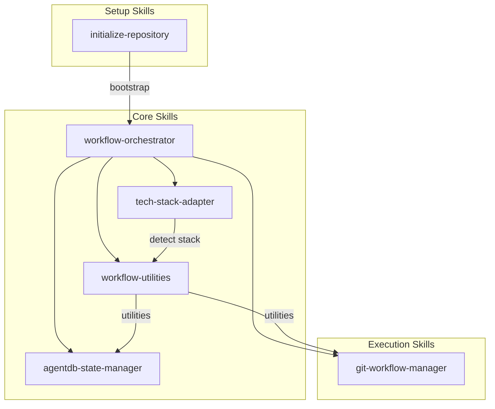

# Workflow Phases Diagram

Visual representation of the streamlined v7x1 workflow system.

## Phase Flow

```mermaid
flowchart TB
    subgraph Feature["Feature Workflow"]
        Step1[/workflow:v7x1_1-worktree<br/>Create isolated<br/>environment]
        Step2[Implementation<br/>Autonomous development<br/>using Gemini tools]
        Step3[/workflow:v7x1_2-integrate<br/>Create PRs from<br/>feature to develop]

        Step1 --> Step2 --> Step3
    end

    subgraph Release["Release Workflow"]
        Step4[/workflow:v7x1_3-release<br/>develop → release → main]
        Step5[/workflow:v7x1_4-backmerge<br/>Sync release to<br/>develop and contrib]

        Step4 --> Step5
    end

    Step3 --> |"Ready for<br/>production"| Step4
    Step5 --> |"Next feature"| Step1
```

## Branch Flow

```mermaid
gitGraph
    commit id: "main"
    branch develop
    commit id: "develop"
    branch contrib/user
    commit id: "contrib"
    branch feature/auth
    commit id: "implement (Gemini tools)"
    commit id: "Gemini review"
    checkout contrib/user
    merge feature/auth id: "PR: feature→contrib"
    checkout develop
    merge contrib/user id: "PR: contrib→develop"
    branch release/v7.0
    commit id: "release prep"
    checkout main
    merge release/v1.0 id: "PR: release→main" tag: "v7.0.0"
    checkout develop
    merge release/v1.0 id: "backmerge"
```

## Autonomous Quality Loop

```mermaid
flowchart LR
    subgraph Loop["Implementation Loop"]
        Plan[Plan]
        Write[Write Code]
        Test[Write Tests]
        Review[Gemini Review]

        Plan --> Write --> Test --> Review
        Review -->|Improve| Plan
    end

    Step1[/workflow:v7x1_1-worktree] --> Loop
    Loop -->|Done| Step3[/workflow:v7x1_2-integrate]
```

## Skill Dependencies



## Related Documentation

- [WORKFLOW.md](../../WORKFLOW.md) - Complete workflow guide
- [workflow-planning.md](workflow-planning.md) - Steps 1-2
- [workflow-integration.md](workflow-integration.md) - Steps 3-4
- [workflow-operations.md](workflow-operations.md) - Operations
