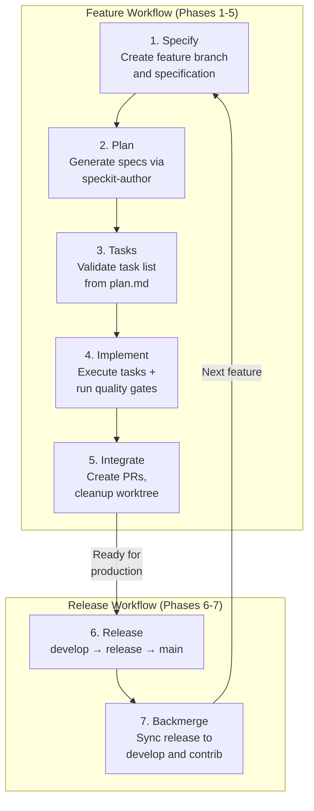
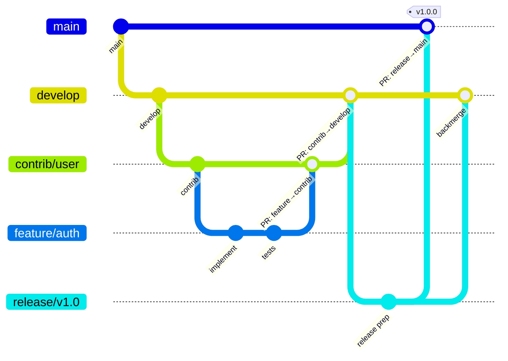
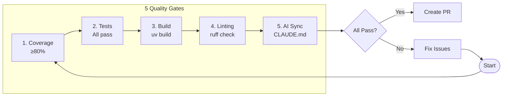
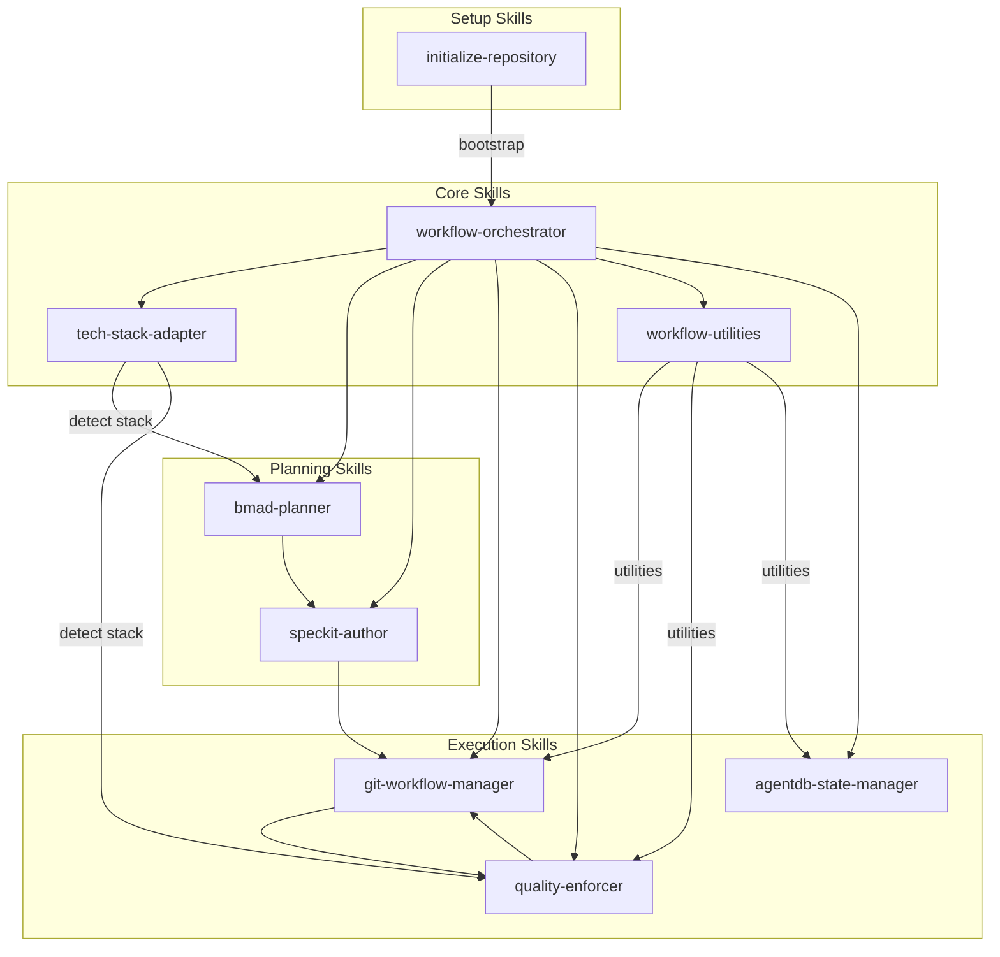
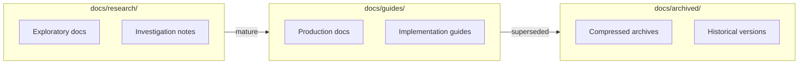

# Workflow Phases Diagram

Visual representation of the 7-phase workflow system.

## Phase Flow



## Branch Flow



## Quality Gates



## Skill Dependencies



## Slash Command Navigation

```mermaid
flowchart LR
    ALL[/workflow/all] --> |"auto-detect"| STATE{Current State}

    STATE --> |"no feature"| S1[/1_specify]
    STATE --> |"has spec"| S2[/2_plan]
    STATE --> |"has plan"| S3[/3_tasks]
    STATE --> |"has tasks"| S4[/4_implement]
    STATE --> |"implemented"| S5[/5_integrate]
    STATE --> |"on develop"| S6[/6_release]
    STATE --> |"released"| S7[/7_backmerge]

    S1 --> S2 --> S3 --> S4 --> S5
    S5 --> |"feature complete"| S6
    S6 --> S7
    S7 --> |"ready for next"| S1
```

## Document Lifecycle



## Related Documentation

- [WORKFLOW.md](../../WORKFLOW.md) - Complete workflow guide
- [workflow-planning.md](workflow-planning.md) - Phases 0-3
- [workflow-integration.md](workflow-integration.md) - Phases 4-5
- [workflow-operations.md](workflow-operations.md) - Operations
